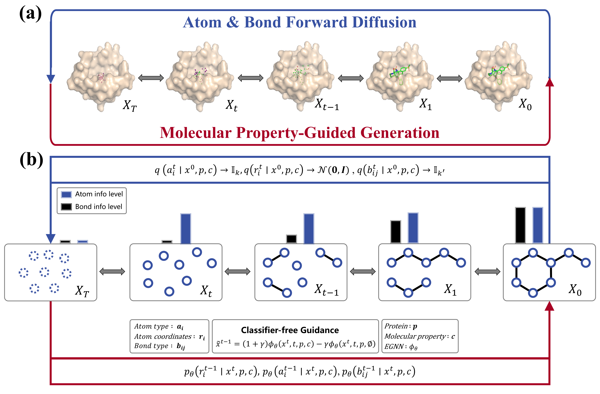
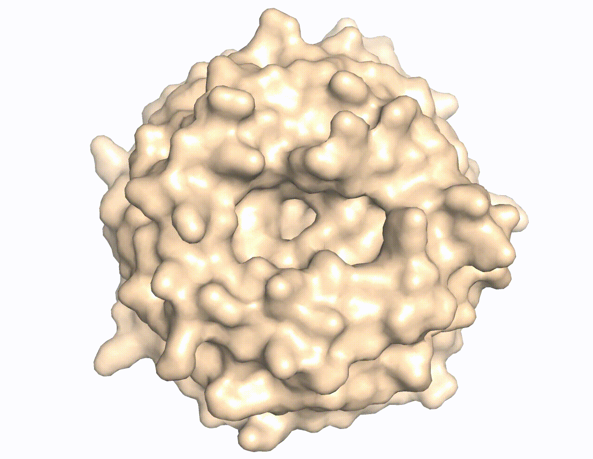

<<<<<<< HEAD
# Target-aware 3D Molecular Generation Based on Guided Equivariant Diffusion Model
Official implementation of ***DiffGui***, a guided diffusion model for *de novo* structure-based drug design and lead optimization, by Qiaoyu Hu<sup>1,#</sup>, Changzhi Sun<sup>1</sup>, Huang He<sup>1</sup>, Jiazheng Xu<sup>1</sup>, Danlin Liu<sup>1</sup>, Wenqing Zhang, Sumeng Shi, Kang Zhang, and Honglin Li<sup>#</sup>.

<p align="center">
  <br>
  <strong>Fig 1.</strong> DiffGui framework
</p>

<p align="center">
<br>
  <strong>Fig 2.</strong> Animation of molecule generation by DiffGui
</p>

## Installation

### Install conda environment via yaml file
```bash
# Create the environment
conda env create -f env.yml
# Activate the environment
conda activate diffgui
```

### Install Vina Docking
```bash
pip install meeko==0.1.dev3 scipy pdb2pqr vina==1.2.2
python -m pip install git+https://github.com/Valdes-Tresanco-MS/AutoDockTools_py3
```

### Install other required softwares
```bash
pip install diffusers==0.21.4 docutils==0.17.1 filelock==3.12.2 fsspec==2023.1.0
pip install softwares/torch_cluster-1.6.1+pt113cu116-cp37-cp37m-linux_x86_64.whl
pip install softwares/torch_scatter-2.1.1+pt113cu116-cp37-cp37m-linux_x86_64.whl
```
The package version should be changed according to your need.

## Datasets
The benchmark datasets utilized in this project are PDBbind and CrossDocked.
### PDBbind
To train the model from scratch, you need to download the preprocessed lmdb file and split file from [here](https://drive.google.com/drive/folders/1pQk1FASCnCLjYRd7yc17WfctoHR50s2r):
* `PDBbind_v2020_pocket10_processed_final.lmdb`
* `PDBbind_pocket10_split.pt`

To process the dataset from scratch, you need to download PDBbind_v2020 from [here](https://www.pdbbind-plus.org.cn/download), save it in `data`, unzip it, and run the following scripts in `data`:
* [clean_pdbbind.py](data/clean_pdbbind.py) will clean the original dataset, extract the binding affinity and calculate QED, SA, LogP, and TPSA of ligands. It will generate a `index.pkl` file and save it in `data/PDBbind_v2020` folder.
    ```bash
    python clean_pdbbind.py --source PDBbind_v2020
    ```
* [extract_pockets.py](data/extract_pockets.py) will extract the pocket file from a 10 Å region around the binding ligand in the original protein file.
    ```bash
    python extract_pockets.py --source PDBbind_v2020 --desti PDBbind_v2020_pocket10
    ```
* [split_dataset.py](data/split_dataset.py) will split the train, validation and test set.
    ```bash
    python split_dataset.py --path PDBbind_v2020_pocket10 --desti PDBbind_pocket10_split.pt --train 17327 --val 1825 --test 100
    ```

### CrossDocked
To train the model from scratch, you need to download the preprocessed lmdb file and split file from [here](https://drive.google.com/drive/folders/1pQk1FASCnCLjYRd7yc17WfctoHR50s2r):
* `crossdocked_v1.1_rmsd1.0_pocket10_processed_final.lmdb`
* `crossdocked_pocket10_pose_split.pt`

To process the dataset from scratch, you need to download CrossDocked2020 v1.1 from [here](https://bits.csb.pitt.edu/files/crossdock2020/), save it in `data`, unzip it, and run the following scripts in `data`:
* [clean_crossdocked.py](data/clean_crossdocked.py) will filter the original dataset and retain the poses with RMSD < 1.0 Å. It will generate a `index.pkl` file and create a new directory containing the filtered data .
    ```bash
    python clean_crossdocked.py --source CrossDocked2020 --dest crossdocked_v1.1_rmsd1.0 --rmsd_thr 1.0
    ```
* [extract_pockets.py](data/extract_pockets.py) will extract the pocket file from a 10 Å region around the binding ligand in the original protein file.
    ```bash
    python extract_pockets.py --source crossdocked_v1.1_rmsd1.0 --dest crossdocked_v1.1_rmsd1.0_pocket10
    ```
* [split_dataset.py](data/split_dataset.py) will split the training and test set. We use the split file `split_by_name.pt`.
    ```bash
    python split_dataset.py --path data/crossdocked_v1.1_rmsd1.0_pocket10 --dest data/crossdocked_pocket10_pose_split.pt --fixed_split data/split_by_name.pt
    ```

## Training
### Trained model checkpoint
The trained model checkpoint files are stored in [here](https://drive.google.com/drive/folders/1pQk1FASCnCLjYRd7yc17WfctoHR50s2r).
* `trained.pt` is the checkpoint file trained on the PDBbind dataset with labeling.
* `bond_trained.pt` is the checkpoint file of bond predictor trained on the PDBbind dataset. This should be used as guidance during the sampling process.

### Training from scratch
```bash
python scripts/train.py --config configs/train/train.yml
```
If you want to resume the training, you need to revise the train.yml file.  
Set `resume` to True and set `resume_ckpt` to the checkpoint that you want to resume, eg. 100000.pt. In addition, `log_dir` should be defined by `args.logdir` (the previous training directory) instead of using `get_new_log_dir` function.

### Training bond predictor
```bash
python scripts/train_bond.py --config configs/train/train_bond.yml
```

## Inference
```bash
python scripts/sample.py --config configs/sample/sample.yml
```
Place the downloaded or self-trained checkpoint files in the `ckpt` folder.

The values of logp, tpsa, sa, qed, aff can be adjusted to generate molecules with desired properties.
* `logp` is octanol-water partition coefficient. It ranges from -2.0 to 5.0. High value indicates hydrophobicity and low value indicates hydrophilicity. The logp values of most drugs are located between 1.0 and 3.0.
* `tpsa` is topogical polar surface area. High value indicates high water solubility and low value indicates high lipid solubility. The tpsa values of most drugs are located between 20 and 60.
* `sa` is synthetic accessibility. It ranges from 0.0 to 10.0. The lower the sa value, the easier the organic synthesis. The reasonable sa values of most drugs are located between 0.0 and 5.0.
* `qed` is quantitative estimate of drug-likeness. It ranges from 0.0 to 1.0. The higher the qed value, the greater the drug-likeness.
* `aff` is binding affinity. It is calculated by -log<sub>10</sub>(*K<sub>d</sub>* or *K<sub>i</sub>* or *IC<sub>50</sub>*). High value indicates high binding affinity. For instance, 8.0 corresponds to 10 nM *K<sub>d</sub>* or *K<sub>i</sub>* or *IC<sub>50</sub>*.

### Sample molecules for given protein pocket
Revise the sample.yml file to sample molecules for any given protein pocket.  
Set `target` to pocket file (eg. sample/3ztx_pocket.pdb), set `gen_mode` to denovo, and set `mode` to pocket.  
In sample folder, you can use the protein file and ligand file to extract the pocket file. For example:
```bash
python extract_pockets.py --protein 3ztx_protein.pdb --ligand 3ztx_ligand.sdf --radius 10 --pocket 3ztx_pocket.pdb
```
If you encounter rdkit error, then use Obabel to formalize the ligand file.
```bash
Obabel 3ztx_ligand.sdf -O3ztx_ligand.sdf
```

### Sample molecules for all pockets in test set
Revise the sample.yml file to sample molecules for all pockets in test set.  
Set `target` to None and set `mode` to test.  
* If you want to sample for the PDBbind test set, then set `path` to data/PDBbind_v2020_pocket10, set `split` to data/PDBbind_pocket10_split.pt, set `protein_root` to data/PDBbind_v2020, and set `dataset` to pdbbind.  
* If you want to sample for the CrossDocked test set, then set `path` to data/crossdocked_v1.1_rmsd1.0_pocket10, set `split` to data/crossdocked_pocket10_pose_split.pt, set `protein_root` to data/crossdocked_v1.1_rmsd1.0, and set `dataset` to crossdocked. 

### Sample molecules based on given fragments (lead optimization)
Revise the sample.yml file to sample molecules based on given fragments.  
Set `target` to pocket file (eg. sample/3ztx_pocket.pdb), set `frag` to fragment file (eg. sample/3ztx_frag.sdf), set `gen_mode` to frag_cond or frag_diff, and set `mode` to pocket.

## Evaluate
```bash
python scripts/evaluate.py --config configs/eval/eval.yml
```
The docking mode can be chosen from {qvina, vina_score, vina_dock, none}.

## Citation
Please consider citing our paper if you find it helpful. Thank you!

Qiaoyu Hu<sup>1,#</sup>, Changzhi Sun<sup>1</sup>, Huang He<sup>1</sup>, Jiazheng Xu<sup>1</sup>, Danlin Liu<sup>1</sup>, Wenqing Zhang, Sumeng Shi, Kang Zhang, and Honglin Li<sup>#</sup>. Target-aware 3D molecular generation based on guided equivariant diffusion. ***Nat. Commun.***, 2025, 16, 7928. https://doi.org/10.1038/s41467-025-63245-0
=======
# diffgui


## Getting started

To make it easy for you to get started with GitLab, here's a list of recommended next steps.

Already a pro? Just edit this README.md and make it your own. Want to make it easy? [Use the template at the bottom](#editing-this-readme)!

## Add your files

- [ ] [Create](https://docs.gitlab.com/ee/user/project/repository/web_editor.html#create-a-file) or [upload](https://docs.gitlab.com/ee/user/project/repository/web_editor.html#upload-a-file) files
- [ ] [Add files using the command line](https://docs.gitlab.com/ee/gitlab-basics/add-file.html#add-a-file-using-the-command-line) or push an existing Git repository with the following command:

```
cd existing_repo
git remote add origin http://localhost:9999/zhangqi/diffgui.git
git branch -M main
git push -uf origin main
```

## Integrate with your tools

- [ ] [Set up project integrations](http://localhost:9999/zhangqi/diffgui/-/settings/integrations)

## Collaborate with your team

- [ ] [Invite team members and collaborators](https://docs.gitlab.com/ee/user/project/members/)
- [ ] [Create a new merge request](https://docs.gitlab.com/ee/user/project/merge_requests/creating_merge_requests.html)
- [ ] [Automatically close issues from merge requests](https://docs.gitlab.com/ee/user/project/issues/managing_issues.html#closing-issues-automatically)
- [ ] [Enable merge request approvals](https://docs.gitlab.com/ee/user/project/merge_requests/approvals/)
- [ ] [Set auto-merge](https://docs.gitlab.com/ee/user/project/merge_requests/merge_when_pipeline_succeeds.html)

## Test and Deploy

Use the built-in continuous integration in GitLab.

- [ ] [Get started with GitLab CI/CD](https://docs.gitlab.com/ee/ci/quick_start/index.html)
- [ ] [Analyze your code for known vulnerabilities with Static Application Security Testing (SAST)](https://docs.gitlab.com/ee/user/application_security/sast/)
- [ ] [Deploy to Kubernetes, Amazon EC2, or Amazon ECS using Auto Deploy](https://docs.gitlab.com/ee/topics/autodevops/requirements.html)
- [ ] [Use pull-based deployments for improved Kubernetes management](https://docs.gitlab.com/ee/user/clusters/agent/)
- [ ] [Set up protected environments](https://docs.gitlab.com/ee/ci/environments/protected_environments.html)

***

# Editing this README

When you're ready to make this README your own, just edit this file and use the handy template below (or feel free to structure it however you want - this is just a starting point!). Thanks to [makeareadme.com](https://www.makeareadme.com/) for this template.

## Suggestions for a good README

Every project is different, so consider which of these sections apply to yours. The sections used in the template are suggestions for most open source projects. Also keep in mind that while a README can be too long and detailed, too long is better than too short. If you think your README is too long, consider utilizing another form of documentation rather than cutting out information.

## Name
Choose a self-explaining name for your project.

## Description
Let people know what your project can do specifically. Provide context and add a link to any reference visitors might be unfamiliar with. A list of Features or a Background subsection can also be added here. If there are alternatives to your project, this is a good place to list differentiating factors.

## Badges
On some READMEs, you may see small images that convey metadata, such as whether or not all the tests are passing for the project. You can use Shields to add some to your README. Many services also have instructions for adding a badge.

## Visuals
Depending on what you are making, it can be a good idea to include screenshots or even a video (you'll frequently see GIFs rather than actual videos). Tools like ttygif can help, but check out Asciinema for a more sophisticated method.

## Installation
Within a particular ecosystem, there may be a common way of installing things, such as using Yarn, NuGet, or Homebrew. However, consider the possibility that whoever is reading your README is a novice and would like more guidance. Listing specific steps helps remove ambiguity and gets people to using your project as quickly as possible. If it only runs in a specific context like a particular programming language version or operating system or has dependencies that have to be installed manually, also add a Requirements subsection.

## Usage
Use examples liberally, and show the expected output if you can. It's helpful to have inline the smallest example of usage that you can demonstrate, while providing links to more sophisticated examples if they are too long to reasonably include in the README.

## Support
Tell people where they can go to for help. It can be any combination of an issue tracker, a chat room, an email address, etc.

## Roadmap
If you have ideas for releases in the future, it is a good idea to list them in the README.

## Contributing
State if you are open to contributions and what your requirements are for accepting them.

For people who want to make changes to your project, it's helpful to have some documentation on how to get started. Perhaps there is a script that they should run or some environment variables that they need to set. Make these steps explicit. These instructions could also be useful to your future self.

You can also document commands to lint the code or run tests. These steps help to ensure high code quality and reduce the likelihood that the changes inadvertently break something. Having instructions for running tests is especially helpful if it requires external setup, such as starting a Selenium server for testing in a browser.

## Authors and acknowledgment
Show your appreciation to those who have contributed to the project.

## License
For open source projects, say how it is licensed.

## Project status
If you have run out of energy or time for your project, put a note at the top of the README saying that development has slowed down or stopped completely. Someone may choose to fork your project or volunteer to step in as a maintainer or owner, allowing your project to keep going. You can also make an explicit request for maintainers.
>>>>>>> bf7fd1d977f806505ec9dfcd60ecc10d6aeb956c
